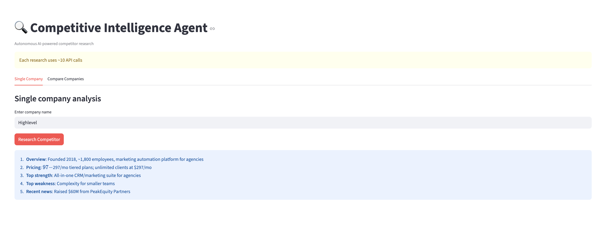
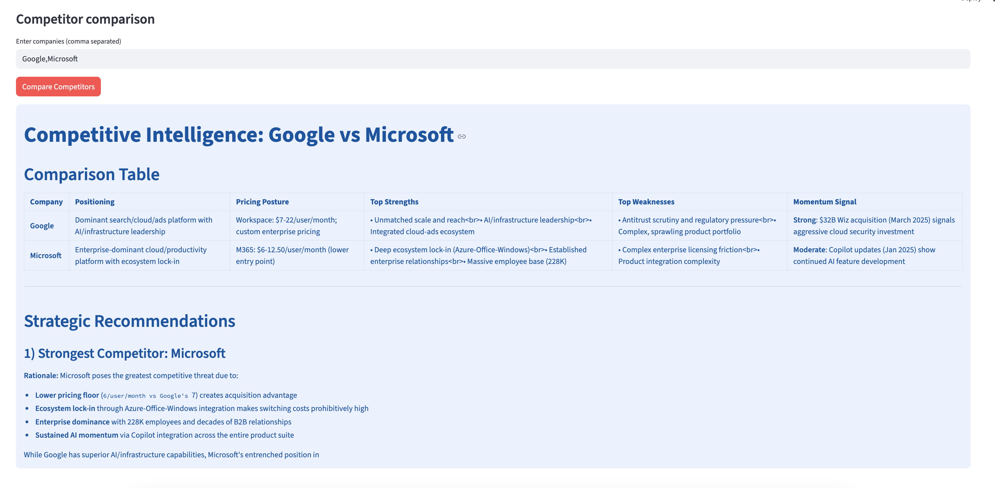

# 🔍 Competitive Intelligence Agent

> Autonomous AI agent that researches any company in minutes.  
> Type a company name — get pricing, strengths, weaknesses, recent news.




---

## The Problem

Before every product decision, strategy meeting, or sales call,
someone manually researches competitors:
- Google searches across 10 tabs
- Reading pricing pages
- Scanning news articles
- Checking G2 reviews

**This takes 2-3 hours. This agent does it in 2-3 minutes.**

---

## What Makes This Different

This is an **autonomous agent** — not a simple API call.

Simple API call (Days 1-7):
Input → Claude → Output
One step, one call, done.
Autonomous Agent (today):
Input: "Research HighLevel"
Agent THINKS: "I need company overview first"
Agent ACTS: search_web("HighLevel company overview")
Agent OBSERVES: [search results]
Agent THINKS: "Now I need pricing"
Agent ACTS: get_pricing_info("HighLevel")
Agent OBSERVES: [pricing results]
Agent THINKS: "Now I need recent news"
Agent ACTS: get_recent_news("HighLevel")
Agent OBSERVES: [news results]
Agent THINKS: "I have enough — synthesise"
Agent RESPONDS: Full competitive brief

The agent decides HOW MANY steps to take and WHICH
tools to use. You just give it the goal.

---

## How It Works
User inputs company name
↓
LangGraph ReAct agent activates
↓
Agent uses tools autonomously:
search_web() — general web search
get_company_info() — funding, team, HQ
get_pricing_info() — plans and costs
get_recent_news() — last 3 months
↓
Claude synthesises all findings
↓
Returns structured competitive brief

---

## Features

**Single Company Research:**
- Company overview (founding, size, funding)
- Pricing snapshot
- Top 3 strengths
- Top 3 weaknesses
- Recent news

**Multi-Company Comparison:**
- Side-by-side comparison table
- Strongest competitor analysis
- Market risk assessment
- 3 actionable recommendations

---

## Tech Stack

| Tool | Purpose |
|---|---|
| LangGraph | ReAct autonomous agent |
| LangChain Anthropic | Claude integration |
| Tavily | Real-time web search for AI |
| Claude Sonnet | Synthesis + analysis |
| Streamlit | Web UI |

---

## The ReAct Pattern
Reason → Act → Observe → Reason → Act → Observe → Done
This loop continues until the agent has
enough information to answer the question.
Different goals = different number of steps.
The agent decides — not you.

---

## How to Run
```bash
cd autonomous-agent
pip install langchain-anthropic langgraph langchain-tavily streamlit
export ANTHROPIC_API_KEY="your-key"
export TAVILY_API_KEY="your-key"
streamlit run app.py
```

---

## Real World Use Cases

- Before competitor strategy meetings
- Before job interviews (research the company)
- Before sales calls (research the prospect)
- Before investment decisions
- Continuous competitor monitoring

---

## Production Upgrades

| Component | Prototype | Production |
|---|---|---|
| Search | Tavily (5 results) | Multiple sources + deeper crawling |
| Cache | None | Redis cache — same company not re-searched |
| Schedule | Manual | Automated weekly competitor monitoring |
| Output | Text | PDF report + email digest |
| History | None | Track competitor changes over time |

---

## PM Insight

**Why autonomous agents beat dashboards for research:**

A dashboard shows you data you already decided to collect.
An autonomous agent finds data you didn't know you needed.

When researching HighLevel, the agent found they process
4 billion API hits/day — a scale signal I wouldn't have
thought to search for manually. That's the value of
autonomous research.

---

*Built as part of a 15-day AI PM portfolio sprint.*  
*[github.com/ishannagar](https://github.com/ishannagar)*