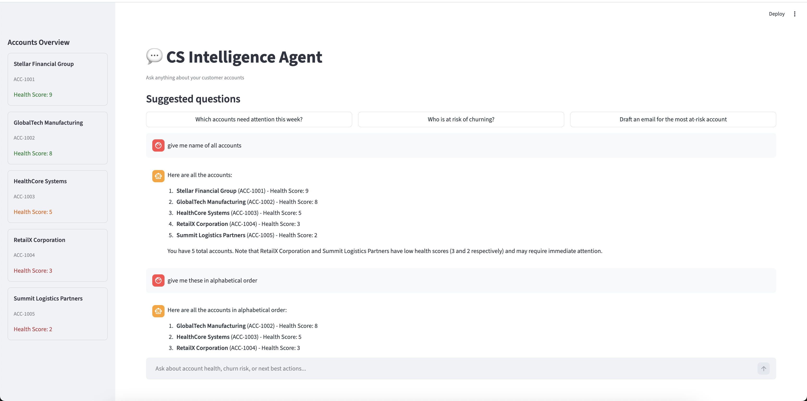

# 💬 CS Intelligence Agent

> A conversational AI agent for Customer Success teams.  
> Ask questions about accounts, get answers, draft emails — all in one chat.



---

## The Problem

CSMs manage 50-200 accounts simultaneously. Getting answers requires:
- Opening Gainsight → filter accounts → find at-risk
- Clicking into each account → read signals
- Switching to email → write outreach manually

Every action is a separate click in a separate screen.
No context carries between actions.

**What if you could just ask?**

---

## What I Built

A conversational agent that remembers context across the full conversation:
```
CSM: "Which accounts need attention this week?"
Agent: "ACC-1004 RetailX and ACC-1005 Summit are high risk..."

CSM: "Tell me more about the worst one"
Agent: [remembers ACC-1005 from previous message]
       "Summit Logistics — health score 2, renews Jan 31..."

CSM: "Draft an urgent email to their CSM"
Agent: [uses full conversation context]
       "Subject: URGENT — Summit Logistics renewal at risk..."

CSM: "Make it more formal"
Agent: [refines based on everything said so far]
```

---

## How It Works
```
User message
      ↓
LangGraph ReAct agent receives:
  System prompt + full conversation history + new message
      ↓
Agent decides which tool to use:
  get_all_accounts() → summary of all accounts
  get_account_details(id) → deep dive one account
  get_at_risk_accounts() → filter risky accounts
      ↓
Tool returns data from local JSON
      ↓
Claude synthesises answer using data + conversation context
      ↓
Response shown in chat UI
History updated for next turn
```

---

## What's New vs Previous Agents

| Feature | Day 6 Agent | Day 10 Conversational Agent |
|---|---|---|
| Interaction | Button clicks | Natural conversation |
| Memory | None — each click independent | Full conversation history |
| Follow-ups | Not possible | "Tell me more about that one" |
| Context | Lost between actions | Carries across entire session |
| Email drafting | Static template | Context-aware, refineable |

---

## Tech Stack

| Tool | Purpose |
|---|---|
| LangGraph | Stateful ReAct agent |
| LangChain Anthropic | Claude integration |
| Claude Sonnet | Reasoning + response generation |
| Streamlit | Chat UI |
| Python | Backend |

---

## New Concepts Learned

**ReAct Pattern (Reason + Act):**
```
Agent receives message
  → Reasons: "I need account data"
  → Acts: calls get_at_risk_accounts()
  → Observes: receives JSON data
  → Reasons: "Now I can answer"
  → Responds: gives specific answer
```

**Conversation Memory:**
Every message includes the full conversation history.
Claude sees everything said before — enabling follow-up questions,
refinements, and context-aware responses.

**LangGraph vs raw Claude API:**
```
Raw API: you manage memory manually
LangGraph: memory, tool calling, agent loop all handled automatically
```

---

## How to Run
```bash
cd cs-conversational-agent
pip install langchain langchain-anthropic langgraph streamlit
export ANTHROPIC_API_KEY="your-key"
streamlit run app.py
```

---

## Production Upgrades

| Component | Prototype | Production |
|---|---|---|
| Data source | Static JSON | Live Gainsight/Salesforce API |
| Memory | Session only | Persistent conversation history |
| Accounts | 5 synthetic | Hundreds of real accounts |
| Auth | None | SSO + role-based access |
| Actions | Draft emails | Actually send emails via CRM |

---

## PM Insight

**Why conversational UI beats dashboards for CS:**

Dashboards show you everything. Conversations answer specific questions.

A CSM at 9am doesn't want to look at 87 accounts.
They want to know: *"What do I need to do today?"*

A conversational agent answers that in one message.
A dashboard makes you find it yourself.

This is the shift from **data tools** to **decision tools**.

---

*Built as part of a 15-day AI PM portfolio sprint.*  
*[github.com/ishannagar](https://github.com/ishannagar)*