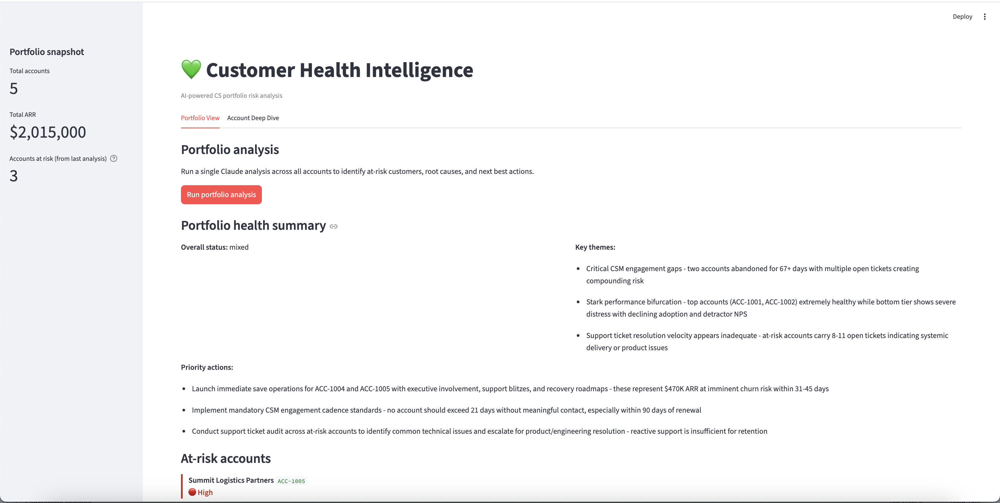

# 💚 Customer Health Intelligence Agent

> AI-powered CS portfolio risk analysis.  
> Know which accounts need attention before they churn.



---

## The Problem

CS teams at B2B SaaS companies manage 50-200 accounts simultaneously.
Churn signals are scattered across multiple systems:

- Product usage dropping → data warehouse
- Support tickets increasing → Zendesk
- NPS score falling → survey tool  
- Champion left → LinkedIn/CRM
- Renewal approaching → CRM

**By the time a CSM notices the pattern — it's too late.**  
Average cost of lost enterprise account: $50,000–$500,000

---

## What I Built

An AI agent that analyses all account signals simultaneously and 
surfaces at-risk accounts before they churn — with specific 
recommended actions per account.

---

## How It Works
```
Load account data + health signals
        ↓
Combine into one context per account
        ↓
Claude analyses all signals simultaneously:
  - Usage trend (growing/stable/declining)
  - NPS score
  - Open support tickets
  - Days since CSM contact
  - Days to renewal
  - Overall sentiment
        ↓
Returns: Risk report + recommended actions
```

---

## Features

**Portfolio View:**
- Overall portfolio health summary
- At-risk accounts flagged with risk level
- Why each account is at risk
- Next best action per account

**Account Deep Dive:**
- Risk score (1-10)
- Churn probability (%)
- Top 3 risk signals
- Recommended actions
- Renewal call talking points

---

## Tech Stack

| Tool | Purpose | Cost |
|---|---|---|
| Claude Sonnet | Risk analysis + recommendations | ~$0.01 per analysis |
| Streamlit | Web UI | Free |
| Python | Backend | Free |

---

## Data (Prototype)

Synthetic but realistic B2B SaaS accounts:

| Account | ARR | Health | Status |
|---|---|---|---|
| Stellar Financial | $485k | 9/10 | Healthy |
| GlobalTech Manufacturing | $720k | 8/10 | Healthy |
| HealthCore Systems | $340k | 5/10 | Mixed |
| RetailX Corporation | $275k | 3/10 | At Risk |
| Summit Logistics | $195k | 2/10 | At Risk |

---

## How to Run
```bash
cd customer-health-agent
pip install anthropic streamlit
export ANTHROPIC_API_KEY="your-key"
python3 generate_data.py
streamlit run app.py
```

---

## Production Architecture
```
Real Data Sources          Ingestion Layer        Agent
─────────────────          ───────────────        ─────
Gainsight API     ──→                             
Salesforce CRM    ──→      Daily sync         →   Claude
Zendesk tickets   ──→      connectors             analyses
NPS tool          ──→                             all signals
Product analytics ──→                                 ↓
                                               Risk report
                                               + actions
```

**Production upgrades:**

| Component | Prototype | Production |
|---|---|---|
| Data source | Static JSON | Live API connectors |
| Trigger | Manual button | Automated daily job |
| Output | Streamlit UI | Slack alerts + email |
| Scale | 5 accounts | 200+ accounts |
| History | None | Trend tracking over time |

---

## PM Insight

**The signal combination problem:**

Any single signal is unreliable:
- Low NPS alone → maybe just a bad survey day
- No CSM contact alone → maybe account is self-sufficient
- Declining usage alone → maybe seasonal

**The combination tells the real story:**
Low NPS + declining usage + no CSM contact + renewal in 30 days
= HIGH CHURN RISK

Claude sees all signals simultaneously and weights them contextually.
That's what makes this better than rule-based health scoring.

---

## My Background

Built after 3 years at **Gainsight** leading CS intelligence products
used by 400+ enterprise customers. I know exactly what CSMs struggle 
with every day — this tool is what I wished we had built sooner.

---

*Built as part of a 15-day AI PM portfolio sprint.*  
*[github.com/ishannagar](https://github.com/ishannagar)*