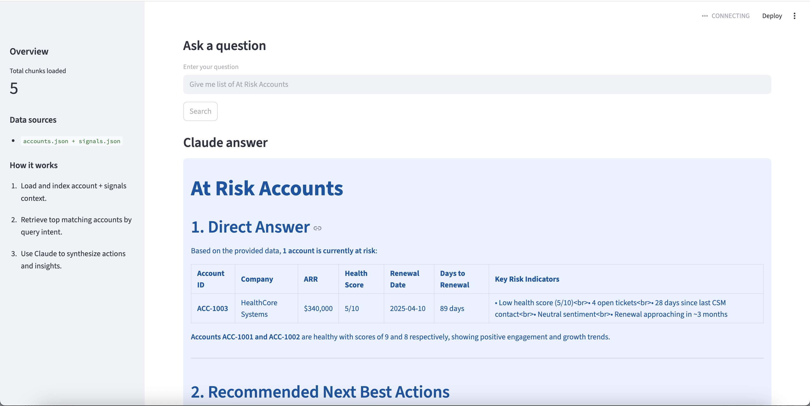

# 🔍 Customer Health Finder
AI-powered enterprise CS agent. Ask in plain English. Get account health insights in seconds.



## What It Does
Loads account + signals data, retrieves top matching accounts by query intent, and uses Claude to synthesize actions and insights.

## Example Queries
- `Give me health of <Account>`
- `Give me list of At Risk Accounts`
- `What can I do to improve account health`

## How to Run
```bash
pip install anthropic lancedb streamlit
export ANTHROPIC_API_KEY="your-key-here"
streamlit run app.py
```

Built as part of a 15-day AI PM portfolio sprint. [github.com/ishannagar](https://github.com/ishannagar)