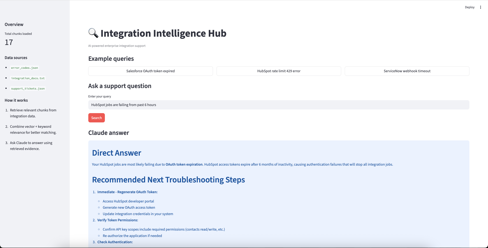

# 🔍 Integration Intelligence Hub

> AI-powered support assistant for enterprise integration failures.   HEllo Hello
> Ask in plain English. Get precise answers with sources in seconds.



---

## The Problem

Enterprise companies run 30–50 integrations simultaneously — Salesforce, 
HubSpot, SAP, ServiceNow, and more. When something breaks at 2am, support 
engineers manually dig through:

- API documentation (scattered across 10 websites)
- Error code databases (usually a shared spreadsheet)
- Past support tickets (buried in Zendesk)
- Slack threads (impossible to search)

**Average resolution time: 4–6 hours per incident.**  
**Cost: $500–2,000 per incident in engineer time.**

This tool reduces that to 30 seconds.

---

## What I Built

A RAG (Retrieval Augmented Generation) system that:

1. Ingests integration documentation, error codes, and past support tickets
2. Stores them in a vector database (LanceDB) with semantic embeddings
3. When asked a question, retrieves the most relevant context
4. Sends that context to Claude to generate a precise, actionable answer
5. Returns the answer with source citations

---

## How It Works
```
User Query
    ↓
Convert query to TF-IDF vector
    ↓
LanceDB searches for similar chunks (semantic search)
    ↓
Top 3 most relevant chunks retrieved
    ↓
Claude reads chunks + generates answer
    ↓
Answer returned with sources cited
```

---

## Tech Stack

| Tool | Purpose | Cost |
|---|---|---|
| Claude Sonnet (Anthropic) | Answer generation | ~$0.01 per query |
| LanceDB | Vector database (local) | Free |
| TF-IDF | Text embeddings | Free |
| Streamlit | Web UI | Free |
| Python | Backend | Free |

**Total infrastructure cost: ~$0.01 per support query**  
vs **$50–200 per hour for a support engineer**

---

## Data Sources (Prototype)

This prototype uses AI-generated synthetic data that mirrors real enterprise patterns:

| File | Contents | Chunks |
|---|---|---|
| `support_tickets.json` | 5 resolved integration tickets | 5 chunks |
| `error_codes.json` | 5 common error codes with resolutions | 5 chunks |
| `integration_docs.txt` | Troubleshooting guide (6 sections) | 8 chunks |

**Total: ~18 chunks indexed in LanceDB**

---

## How to Run
```bash
# Clone the repo
git clone https://github.com/ishannagar/ai-pm-portfolio

# Navigate to project
cd integration-intelligence-hub

# Install dependencies
pip install anthropic lancedb streamlit pypdf2

# Set API key
export ANTHROPIC_API_KEY="your-key-here"

# Generate synthetic data
python3 generate_data.py

# Run the app
streamlit run app.py
```

Open `http://localhost:8501` in your browser.

---

## Example Queries

- `"Salesforce OAuth token expired error"`
- `"HubSpot jobs failing for past 6 hours"`
- `"ServiceNow webhook timeout"`
- `"SAP SSL certificate error"`
- `"How do I fix a 429 rate limit error?"`

---

## Production Architecture

This prototype demonstrates the concept. Here's what a production 
version would look like:
```
Data Sources (Real-time)       Ingestion Layer        RAG System
────────────────────────       ───────────────        ──────────
Zendesk API          ──→                              
Confluence API       ──→       Daily sync         →   Pinecone
GitHub Releases      ──→       connectors             (cloud vector DB)
Slack Export         ──→                                   ↓
ReadMe/GitBook docs  ──→                              Claude answers
                                                      with citations
```

**Production upgrades needed:**

| Component | Prototype | Production |
|---|---|---|
| Vector DB | LanceDB (local) | Pinecone (cloud, scalable) |
| Embeddings | TF-IDF | OpenAI text-embedding-3-small |
| Data sources | Static JSON files | Live API connectors (Zendesk, Confluence) |
| Updates | Manual regeneration | Automated daily sync |
| Auth | None | SSO + role-based access |
| Scale | 18 chunks | Millions of chunks |
| Latency | ~3 seconds | <1 second with caching |

---

## PM Insight

**Why this matters beyond the demo:**

The data ingestion layer is harder than the AI layer.

Most RAG tutorials show you how to ask Claude a question. The real 
engineering challenge is:
- Keeping the vector DB in sync with live systems
- Handling data quality issues (duplicate tickets, outdated docs)
- Deciding what NOT to ingest (noise degrades answer quality)
- Building feedback loops (did the answer actually help?)

These are product decisions, not engineering decisions. This is where 
AI PMs create the most value.

---

## My Background

I built this after leading the integrations platform at **UiPath** 
(30+ enterprise connectors) and **Gainsight** ($8M revenue from 
integration platform). I know this problem from the inside.

The same architecture this tool uses is what enterprise companies 
like MuleSoft, Boomi, and Workato are building for their support teams.

---

## What's Next

- [ ] Connect to live Zendesk API for real ticket ingestion
- [ ] Add Pinecone for production-scale vector storage  
- [ ] Build feedback loop — thumbs up/down on answers
- [ ] Add multi-tenant support for different integration platforms
- [ ] Deploy on Streamlit Cloud with authentication

---

*Built as part of a 15-day AI PM portfolio sprint.*  
*[github.com/ishannagar](https://github.com/ishannagar)*