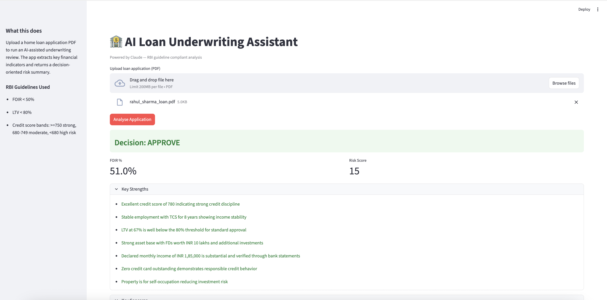
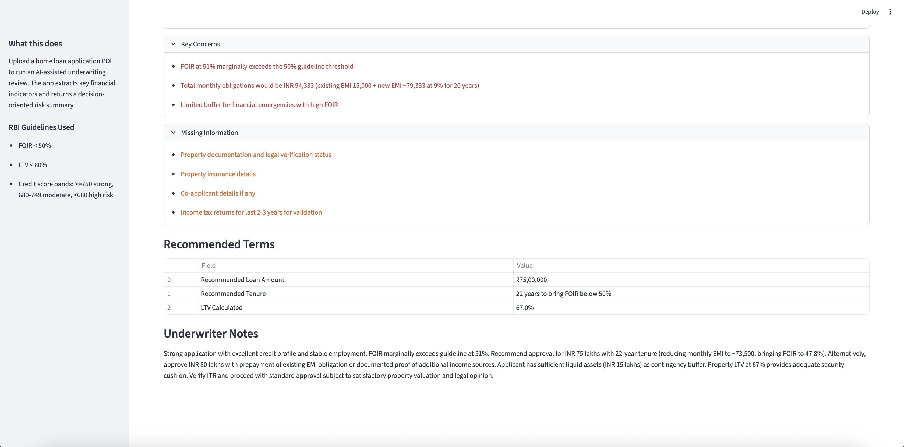

# 🏦 AI Loan Underwriting Assistant

> RBI-compliant home loan analysis in seconds.  
> Upload a loan application PDF — get a full underwriting decision instantly.


---

---

## The Problem

Indian banks process millions of home loan applications every year.
Today this is almost entirely manual:

- Underwriter reads 15-20 page application
- Manually calculates FOIR, LTV, debt ratios
- Cross-checks against RBI guidelines
- Makes decision in 7-14 days

**Cost per application: ₹2,000–5,000 in manual effort**
**Average decision time: 7–14 days**
**Error rate: High — inconsistent across underwriters**

Small NBFCs and cooperative banks can't afford large underwriting
teams. They either reject good loans or approve risky ones.

---

## What I Built

An AI underwriting assistant that:

1. Accepts any home loan application PDF
2. Extracts key financial signals using PyPDF2
3. Sends to Claude with RBI-guideline-aware system prompt
4. Returns structured underwriting decision in seconds

---

## How It Works
```
Upload loan application PDF
        ↓
PyPDF2 extracts all text from PDF
        ↓
Claude acts as senior bank underwriter:
  - Extracts: income, EMIs, credit score, loan amount, property value
  - Calculates: FOIR, LTV
  - Validates against RBI guidelines
  - Assesses: employment stability, assets, liabilities
        ↓
Returns structured decision:
  APPROVE / REJECT / MANUAL REVIEW
  + Risk score
  + Key strengths
  + Key concerns  
  + Missing documents
  + Recommended loan terms
```

---

## RBI Guidelines Applied

| Guideline | Threshold | Impact |
|---|---|---|
| FOIR (Fixed Obligation to Income Ratio) | < 50% | High — primary filter |
| LTV (Loan to Value) | < 80% for loans > ₹75L | High — collateral protection |
| Credit score | > 750 strong, 680-749 moderate, < 680 high risk | High |
| Employment stability | Salaried preferred, 2+ years | Medium |
| Income documentation | Bank statements mandatory | Medium |

---

## Sample Test Cases

**Rahul Sharma — APPROVE:**
- Income: ₹1,85,000/month
- EMIs: ₹15,000/month
- FOIR: 8.1% (well below 50%)
- Credit score: 780
- LTV: 66.7%
- Employment: 8 years at TCS

**Priya Patel — REJECT/MANUAL REVIEW:**
- Income: ₹65,000/month (irregular)
- EMIs: ₹28,000/month
- FOIR: 43% + irregular income = effective risk higher
- Credit score: 620 (high risk band)
- LTV: 88.2% (exceeds 80% threshold)
- Employment: Freelancer, 2 years only

---

## Tech Stack

| Tool | Purpose | Cost |
|---|---|---|
| Claude Sonnet (Anthropic) | Underwriting analysis | ~$0.01 per application |
| PyPDF2 | PDF text extraction | Free |
| ReportLab | Sample PDF generation | Free |
| Streamlit | Web UI | Free |
| Python | Backend | Free |

**Cost per underwriting decision: ~₹1**
vs **₹2,000–5,000 for manual underwriting**

---

## How to Run
```bash
cd loan-underwriting
pip install anthropic streamlit pypdf2 reportlab
export ANTHROPIC_API_KEY="your-key"

# Generate sample applications
python3 generate_loan_application.py

# Run the app
streamlit run app.py
```

Open `http://localhost:8501` → upload either PDF from `applications/` folder.

---

## Production Architecture
```
Real World Integration          AI Layer           Output
────────────────────            ────────           ──────
Bank's loan origination  ──→    
system (LOS)                    Claude             Decision
                         ──→    underwriting   →   + Risk score
Document management             engine             + Audit trail
system (DMS)             ──→                       + Compliance log
                                                   + Recommended terms
Credit bureau API        ──→
(CIBIL/Experian)
```

**Production upgrades needed:**

| Component | Prototype | Production |
|---|---|---|
| PDF source | Manual upload | API from LOS/DMS |
| Credit score | From PDF text | Live CIBIL API |
| Property valuation | From PDF text | Live valuation API |
| Decision storage | None | Audit database |
| Compliance logging | None | Full audit trail |
| Human review queue | None | Workflow integration |
| Model | Claude API | Fine-tuned on bank's historical decisions |

---

## PM Insight

**Why AI underwriting is inevitable:**

The underwriting decision is fundamentally a pattern matching problem:
- Input: financial signals
- Rules: RBI guidelines + bank policy
- Output: approve/reject + terms

Humans are inconsistent at pattern matching at scale.
AI is consistent, fast, and auditable.

**The real challenge isn't the AI — it's the audit trail.**

Every AI underwriting decision needs to be explainable:
- Why was this approved?
- Which guidelines were applied?
- What would change the decision?

This prototype shows the decision. A production system needs
full explainability logging for RBI compliance.

**That's a product problem, not an engineering problem.**

---

## What's Next

- [ ] Connect to live CIBIL API for real credit scores
- [ ] Add multi-document upload (income proof, bank statements separately)
- [ ] Build audit trail — log every decision with reasoning
- [ ] Add comparison mode — compare two applications side by side
- [ ] Fine-tune on bank's historical approval/rejection data
- [ ] Deploy with authentication for bank staff access

---

*Built as part of a 15-day AI PM portfolio sprint.*  
*[github.com/ishannagar](https://github.com/ishannagar)*