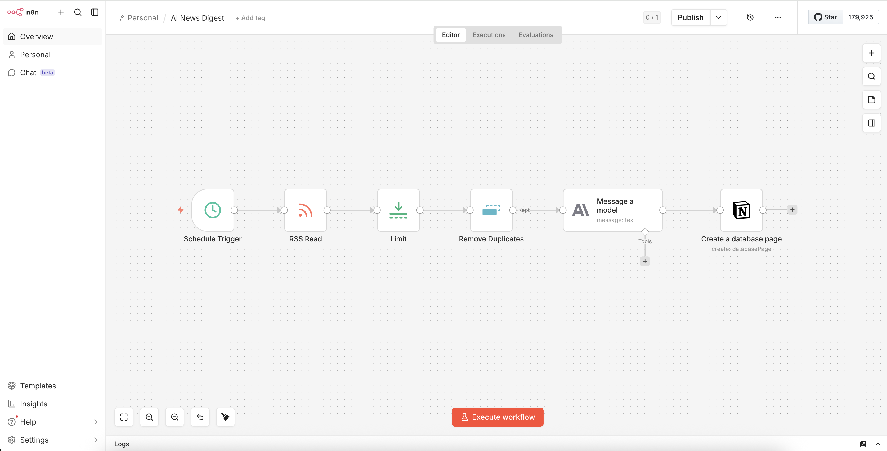

# Day 03 — n8n AI Workflows

## What I built
An automated AI news digest that runs every morning at 9am, 
fetches the top 5 AI/PM articles, summarises them using Claude, 
and saves them to Notion — completely hands-free.

## Workflow 1 — AI News Digest (Daily)

## Workflow Architecture



### How it works
```
Schedule Trigger (9am daily)
    → RSS Read (fetches latest articles from TechCrunch AI feed)
    → Limit (top 5 articles only)
    → Remove Duplicates (deduplicates by article URL)
    → Anthropic Claude (summarises each article in 3 bullet points)
    → Notion (saves to AI News Digest database)
```

### What Claude does
For each article, Claude generates a structured 3-point summary:
- **What happened** — the key event or announcement
- **Why it matters** — relevance for AI/product managers
- **Key takeaway** — actionable insight

### Output
Every morning, Notion is automatically populated with 5 fresh, 
AI-summarised articles — ready to read with your morning coffee.

### Tools used
- **n8n** — open source workflow automation (self-hosted)
- **Anthropic Claude API** — article summarisation
- **Notion** — knowledge base destination
- **TechCrunch RSS** — news source

## What I learned
- How n8n nodes, triggers, and connections work
- How to pass dynamic data between nodes using `{{$json.field}}`
- How to deduplicate data to avoid repeated entries
- How to connect Claude API inside a no-code workflow
- The difference between agents and workflows — workflows are 
  deterministic (same steps every time), agents are dynamic 
  (Claude decides the steps)

## PM Insight
This workflow replaces 30 minutes of manual news reading with 
a 2-minute Notion scan. At scale, this pattern — fetch → AI process 
→ store — powers most enterprise AI automation use cases. 
The same architecture used here is what companies like UiPath 
are building for enterprise data pipelines, just at larger scale 
with more data sources.

## Remaining workflows (coming next)
- Workflow 2: Research Tracker (AI + Quantum + Space + Indian Defense)
- Workflow 3: AI PM Job Alert (personalised job matching)
- Workflow 4: Indian Stock Fundamentals (daily top 5 picks)

## How to run locally
1. Install n8n: `npm install -g n8n`
2. Start n8n: `n8n start`
3. Open: `http://localhost:5678`
4. Import `AI News Digest.json`
5. Add your Anthropic API key and Notion credentials
6. Activate the workflow