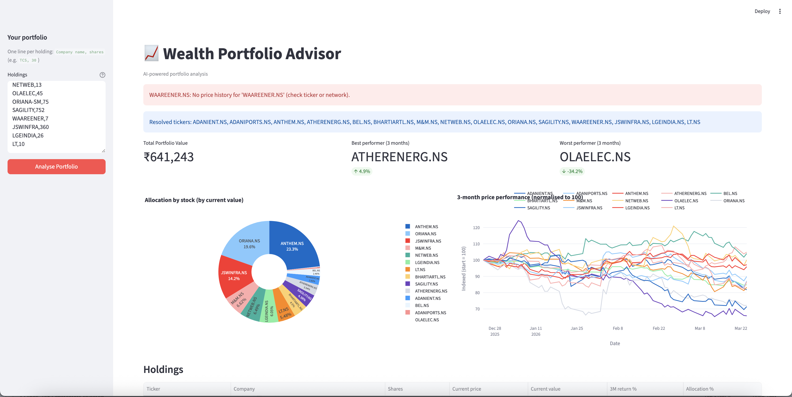
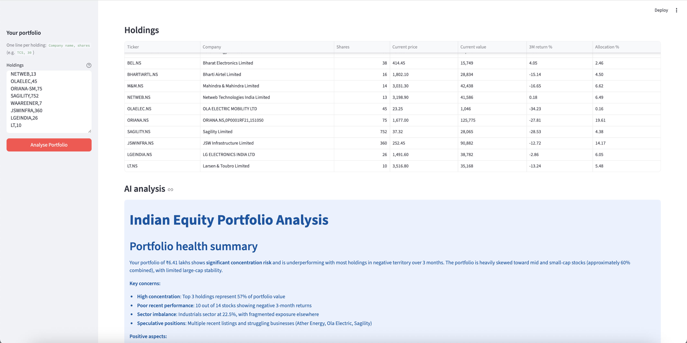
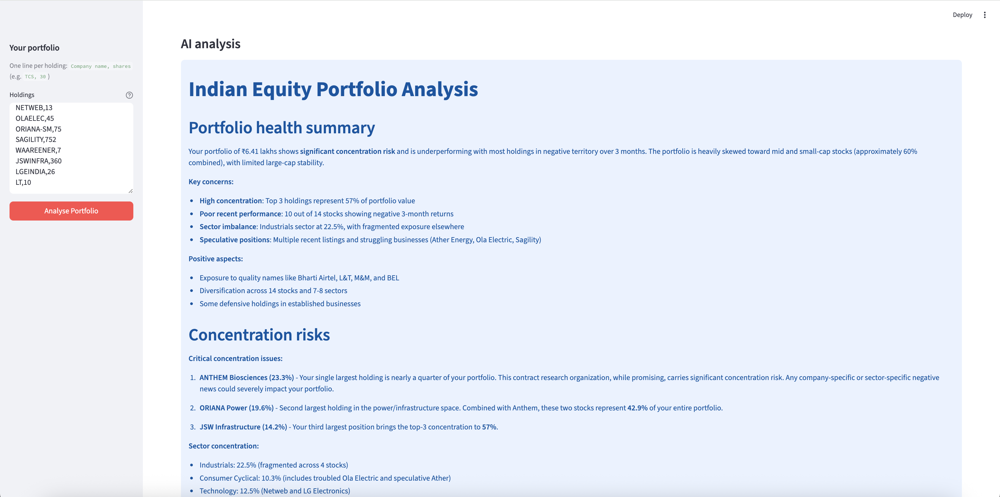
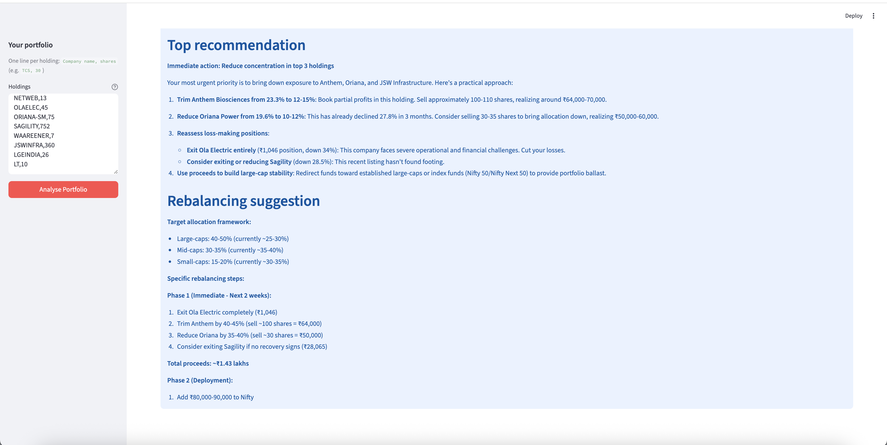

# 📈 Wealth Portfolio Advisor

> AI-powered Indian equity portfolio analysis.  
> Type company names — get live charts, performance data, and Claude's advice.





---

## The Problem

Independent Financial Advisors (IFAs) in India manage 50-200 client 
portfolios simultaneously. Every week they need to:

- Check how each portfolio performed
- Explain performance to clients in plain English
- Identify concentration risks
- Recommend rebalancing if needed

**This takes 2-3 hours manually per advisor per week.**

Most retail investors don't understand their own portfolio. They know 
they hold "Reliance and TCS" but can't tell you their allocation, 
3-month return, or whether they're overexposed to one sector.

---

## What I Built

A portfolio analysis tool where you type company names in plain English 
— no ticker symbols needed — and get instant AI-powered analysis.

---

## How It Works
```
User types company names + shares:
  Larsen and Toubro, 50
  TCS, 30
  Sagility, 100
  Waree Energy, 25
        ↓
Claude resolves names to NSE tickers:
  LT.NS, TCS.NS, SAGILITY.NS, WAREQ.NS
        ↓
yfinance fetches live data:
  Current prices, 3-month history, sector info
        ↓
Calculates:
  Portfolio value, allocation %, 3-month returns
        ↓
Plotly generates:
  Pie chart (allocation) + Line chart (performance)
        ↓
Claude analyses portfolio:
  Health summary, concentration risks,
  rebalancing suggestion, market context
        ↓
Everything displayed in one clean dashboard
```

---

## Features

**Portfolio Dashboard:**
- Total portfolio value in ₹
- Best and worst performer (3 months)
- Interactive allocation pie chart
- Normalised 3-month performance chart
- Full holdings table with returns

**AI Analysis (Claude):**
- Portfolio health summary
- Concentration risk flags
- Top recommendation
- Rebalancing suggestion
- Market context

**Smart ticker resolution:**
- Type company names naturally
- Claude maps to correct NSE tickers
- No need to know BSE/NSE codes

---

## Tech Stack

| Tool | Purpose | Cost |
|---|---|---|
| Claude Sonnet | Ticker resolution + portfolio analysis | ~$0.01 per analysis |
| yfinance | Live NSE/BSE stock data | Free |
| Plotly | Interactive charts | Free |
| Streamlit | Web UI | Free |
| pandas | Data processing | Free |

---

## How to Run
```bash
cd wealth-portfolio-advisor
pip install anthropic streamlit yfinance plotly pandas
export ANTHROPIC_API_KEY="your-key"
streamlit run app.py
```

Open `http://localhost:8501`

**Example input:**
```
Reliance Industries, 50
TCS, 30
Infosys, 40
HDFC Bank, 25
Wipro, 100
```

---

## Supported Markets

| Market | Ticker suffix | Example |
|---|---|---|
| NSE India | .NS | RELIANCE.NS |
| BSE India | .BO | RELIANCE.BO |
| US stocks | none | AAPL |
| UK stocks | .L | HSBA.L |

---

## Production Architecture
```
Real World                    AI Layer              Output
──────────────                ────────              ──────
Demat account API    ──→      Claude ticker     →   Dashboard
(Zerodha/Groww)               resolution            + Charts
                     ──→                            + AI advice
Live market feed              yfinance live         + Email report
(NSE data stream)    ──→      prices
                              
Client CRM           ──→      Claude portfolio
(IFA's system)                analysis
```

**Production upgrades needed:**

| Component | Prototype | Production |
|---|---|---|
| Data source | yfinance (delayed) | NSE live feed |
| Portfolio input | Manual text | Demat API sync |
| Auth | None | IFA login + client accounts |
| History | 3 months | Full holding period |
| Reports | On-screen | PDF export + email |
| Alerts | None | Price + rebalancing alerts |

---

## PM Insight

**Why name resolution matters:**

Most retail investors don't know ticker symbols. "HDFCBANK.NS" means 
nothing to them. "HDFC Bank" does.

The barrier to entry for most financial tools is the assumption that 
users know how markets work. This tool removes that barrier — type 
what you know, the AI figures out the rest.

**The bigger insight:**

Natural language as input is not a nice-to-have for financial tools. 
It's the difference between a tool that's used and a tool that sits 
unused because it's "too technical."

This applies to every enterprise product that requires structured 
input from non-technical users.

---

## What's Next

- [ ] Add mutual fund support (not just stocks)
- [ ] Portfolio comparison — my portfolio vs Nifty 50
- [ ] Risk score calculation (beta, volatility)
- [ ] PDF report export for client meetings
- [ ] Email digest — daily portfolio brief
- [ ] Multi-client support for IFAs

---

*Built as part of a 15-day AI PM portfolio sprint.*  
*[github.com/ishannagar](https://github.com/ishannagar)*